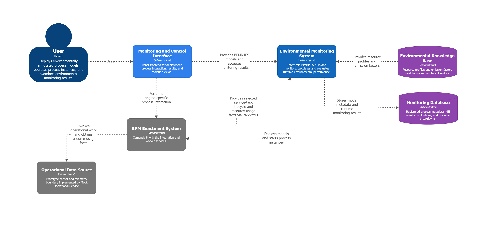

# Runtime Environmental Monitoring Prototype

Runtime is a prototype for connecting BPMN-level Key Environmental Indicator (KEI) metadata to process execution. It deploys BPMN4ES-annotated process models to Camunda 8, observes selected service-task executions, calculates environmental values from runtime resource usage, evaluates optional targets, and exposes the resulting monitoring state through REST and WebSocket interfaces.

The workflow engine remains responsible for process orchestration. KEI interpretation, environmental calculation, threshold evaluation, persistence, and visualization are performed by services outside the engine.

## Capabilities

- Deploy executable BPMN models containing BPMN4ES KEI annotations.
- Start Camunda 8 process instances with caller-provided variables.
- Find and complete active Camunda user tasks from the frontend.
- Associate completed service-task executions with their BPMN element and process-instance context.
- Retrieve the KEIs registered for an observed BPMN element.
- Calculate carbon emissions from mock resource usage, resource profiles, and emission factors.
- Record calculated values even when a KEI has no target.
- Evaluate calculated values against numeric targets when a target is present.
- Persist process models, KEI annotations, calculation metadata, monitoring records, and resource-level calculation breakdowns.
- Query records, process-instance details, and violated evaluations.
- Push persisted calculation, evaluation, and violation updates to the frontend over STOMP/WebSocket.
- Render the deployed BPMN model with calculated values and threshold status overlaid on its elements.


## Architecture

The architecture follows the environmental-monitoring portion of the green BPM
lifecycle while mapping the reference concepts to concrete prototype services:


| Green BPM reference concept          | Prototype mapping                                                                      |
| ------------------------------------ | -------------------------------------------------------------------------------------- |
| BPM Enactment System                 | Camunda 8, Camunda Integration, and Camunda Worker                                     |
| Process Models                       | BPMN models and BPMN4ES KEI mappings managed through Process Registry                  |
| Process lifecycle events             | Selected service-task completion and resource-usage facts emitted by the worker        |
| Environmental Performance Calculator | Observation prepares the runtime observation; CO2 Calculation performs the calculation |
| Calculator Service                   | CO2 Calculation Service                                                                |
| Compliance Checker                   | KEI Evaluation Service                                                                 |
| Environmental Monitoring Component   | Observation, CO2 Calculation, KEI Evaluation, and Monitoring Results collectively      |
| Monitoring Database                  | Monitoring Results PostgreSQL database                                                 |
| Sensors                              | Prototype boundary represented by Mock Operational Service                             |
| Knowledge Base                       | Partly represented by resource profiles and emission factors                           |


The architecture can be narrowed down to a high-level system-context view: 

### Runtime Flow

1. The frontend submits a BPMN file to Process Registry.
2. Process Registry sends the resource to Camunda 8 Integration, which deploys it to Camunda 8.
3. Process Registry parses the deployed BPMN XML and synchronously registers the model, its BPMN elements, and their KEI annotations with Monitoring Results.
4. The frontend starts a process instance using the returned process-definition key and a JSON variables object.
5. Camunda activates service tasks with job type `default-worker`. The worker requests deterministic execution data from Mock Operational Service, publishes the completed execution context and resource usage, and completes the Camunda job.
6. Observation consumes the completed-task event, retrieves the KEIs associated with the executed BPMN element from Process Registry, and publishes one calculator request per KEI.
7. CO2 Calculation resolves resource profiles and emission factors, calculates the KEI value and per-resource contributions, then publishes a completed or failed calculation event.
8. Successful calculations are delivered to both KEI Evaluation and Monitoring Results. Evaluation publishes a result only when the KEI has a numeric target.
9. Monitoring stores targetless calculations directly. Calculations with targets are stored from the later evaluation event, avoiding two rows for the same execution and KEI.
10. After a record is persisted, Monitoring broadcasts the saved projection to the corresponding STOMP topics. The frontend combines REST-loaded state with these live updates.


## Functional Mechanisms


### BPMN4ES Parsing

Process Registry uses a namespace-aware DOM parser for the BPMN4ES namespace `https://github.com/michel-medema/BPMN4ES`. During deployment it finds `environmentalIndicators` extension elements, associates them with the nearest BPMN parent element, and extracts:

- BPMN element ID, name, and type
- KEI ID
- unit
- optional target value
- icon identifier

The resulting runtime metadata is stored by Monitoring Results. Process Registry reads it back from Monitoring when Observation requests the KEIs for an executed activity, so the lookup survives a Process Registry restart.

### Mock Execution Data

The Camunda worker does not invent environmental inputs. It sends the BPMN element ID and the process `workObject` to Mock Operational Service. That service matches the request against `[mock-execution-runs.json](mock-operational-service/infrastructure/src/main/resources/mock-execution-runs.json)` and returns the resources used, usage values, and units.

This represents the prototype's mocked data-collection boundary. Production sensors and an environmental knowledge base are outside this repository.

### Carbon-Emission Calculation

CO2 Calculation combines observed resource usage with reference data stored in PostgreSQL:

```text
fuel consumed = usage value x resource fuel consumption per usage unit
resource emissions = fuel consumed x emission factor
task emissions = sum of resource emissions
```

The completed result includes the total in kilograms, calculator identity, calculation method, reference set, and a resource breakdown containing resource name, usage, and emission contribution. See the [CO2 Calculation README](co2-calculation-service/README.md) for an example.

### Threshold Evaluation

KEI Evaluation reads the optional target from the KEI annotation:

```text
calculated value <= target  -> WITHIN_TARGET
calculated value > target   -> VIOLATED
difference                  = calculated value - target
```

A missing or non-numeric target produces no evaluation event. The targetless calculation is still retained by Monitoring Results.

### Monitoring and WebSocket Updates

Monitoring Results is the read-model owner for the frontend. On page load, the frontend retrieves persisted records and violations through REST. It then opens a native WebSocket connection using STOMP at:

```text
ws://localhost:8094/ws/monitoring
```

The available topics are:


| Topic                            | Published after                               |
| -------------------------------- | --------------------------------------------- |
| `/topic/monitoring/calculations` | A targetless calculation is persisted.        |
| `/topic/monitoring/evaluations`  | An evaluated result is persisted.             |
| `/topic/monitoring/violations`   | A persisted evaluation has status `VIOLATED`. |


The process-instance view loads the stored BPMN XML through REST, renders it with `bpmn-js`, and overlays the latest persisted monitoring records on the corresponding BPMN elements.

## Services


| Component                                                          | Default port | Responsibility                                                                            |
| ------------------------------------------------------------------ | ------------ | ----------------------------------------------------------------------------------------- |
| [Process Registry](process-registry-service/README.md)             | `8080`       | Deployment entry point, BPMN4ES parsing, KEI lookup, and process-instance start requests. |
| [Camunda 8 Integration](camunda-8-integration/README.md)           | `8090`       | HTTP adapter for Camunda deployment, process start, and user-task commands.               |
| [Camunda 8 Worker](camunda-8-worker-service/README.md)             | none         | Executes `default-worker` jobs and publishes completed service-task observations.         |
| [Mock Operational Service](mock-operational-service/README.md)     | `8091`       | Supplies deterministic resource usage for an executed BPMN element and work object.       |
| [Observation Service](observation-service/README.md)               | none         | Enriches completed tasks with KEI metadata and routes calculator requests.                |
| [CO2 Calculation Service](co2-calculation-service/README.md)       | `8092`       | Calculates carbon emissions and resource-level contributions.                             |
| [KEI Evaluation Service](kei-evaluation-service/README.md)         | `8093`       | Compares calculated values with optional numeric targets.                                 |
| [Monitoring Results Service](monitoring-results-service/README.md) | `8094`       | Persists the monitoring projection and exposes REST and STOMP interfaces.                 |
| [Frontend](frontend)                                               | `5173`       | Deploys and starts processes, completes user tasks, and displays monitoring state.        |


## Messaging Routes

All backend event routes use durable RabbitMQ topic exchanges and JSON payloads.


| Producer         | Exchange                     | Routing key                         | Queue / consumer                                            | Purpose                                                                                                   |
| ---------------- | ---------------------------- | ----------------------------------- | ----------------------------------------------------------- | --------------------------------------------------------------------------------------------------------- |
| Camunda 8 Worker | `runtime.camunda8.events`    | `engine.task.completed`             | `runtime.observation.engine-task-completed` / Observation   | Report a completed service-task execution and its resource usage.                                         |
| Observation      | `runtime.observation.events` | `kei.calculation.requested.<keiId>` | KEI-specific calculator queue                               | Route each observed KEI to a calculator. The CO2 route uses `kei.calculation.requested.carbon-emissions`. |
| CO2 Calculation  | `runtime.calculation.events` | `kei.calculation.completed`         | `runtime.evaluation.kei-calculation-completed` / Evaluation | Evaluate successful calculations that have targets.                                                       |
| CO2 Calculation  | `runtime.calculation.events` | `kei.calculation.completed`         | `runtime.monitoring.kei-calculation-completed` / Monitoring | Persist successful targetless calculations.                                                               |
| CO2 Calculation  | `runtime.calculation.events` | `kei.calculation.failed`            | No queue in the current local stack                         | Publish calculation failure details for an interested consumer.                                           |
| KEI Evaluation   | `runtime.evaluation.events`  | `kei.evaluation.completed`          | `runtime.monitoring.kei-evaluation-completed` / Monitoring  | Persist threshold evaluation results and expose violations.                                               |


The routing key suffix is derived from the KEI ID. Adding a calculator therefore requires binding its queue to the corresponding `kei.calculation.requested.<keiId>` route.

## Persistence


### CO2 Reference Database

The `co2_calculation` PostgreSQL database stores calculator inputs, not monitoring results:


| Table               | Contents                                                                   |
| ------------------- | -------------------------------------------------------------------------- |
| `resource_profiles` | Resource fuel consumption, fuel type, and usage units for a reference set. |
| `emission_factors`  | Emission factor and fuel unit for a reference set and fuel type.           |


`[schema.sql](co2-calculation-service/bootstrap/src/main/resources/schema.sql)` creates and seeds these tables. Spring runs it on local service startup; PostgreSQL also runs it when the Docker volume is first initialized.

### Monitoring Database

The `monitoring_results` PostgreSQL database stores the queryable runtime projection:


| Table                    | Contents                                                                                       |
| ------------------------ | ---------------------------------------------------------------------------------------------- |
| `process_definition`     | Deployment identifiers, BPMN process ID, version, resource name, and BPMN XML.                 |
| `bpmn_element`           | Elements registered from the deployed BPMN model.                                              |
| `kei_annotation`         | KEI ID, unit, optional target, and icon for a BPMN element.                                    |
| `process_instance`       | Camunda process-instance key and its process definition.                                       |
| `kei_result`             | Calculated value, optional evaluation, execution context, calculator metadata, and timestamps. |
| `kei_resource_breakdown` | Resource usage and emission contribution belonging to a KEI result.                            |


Monitoring records are rows from `kei_result` projected with their related process, element, annotation, and resource data.

Violations are not stored in a separate violation table. A violation is an evaluated `kei_result` whose `evaluation_status` is `VIOLATED`. The `/api/monitoring/violations/active` endpoint queries that projection. In the current prototype, “active” means persisted violated evaluations; there is no separate acknowledgement or resolution lifecycle.

The local Compose deployment uses named volumes, so RabbitMQ, Camunda, Elasticsearch, and both PostgreSQL databases retain data across ordinary `down` and `up` operations. Running `reset-local.sh` removes those volumes.

## HTTP API


### Process Registry: `http://localhost:8080`


| Method | Path                                                                              | Input / purpose                                                                                                  |
| ------ | --------------------------------------------------------------------------------- | ---------------------------------------------------------------------------------------------------------------- |
| `POST` | `/api/process-definitions/deploy`                                                 | Multipart `resource` BPMN file and optional `targetEngine` (default `CAMUNDA_8`). Deploy and register the model. |
| `POST` | `/api/process-definitions/{processDefinitionKey}/instances`                       | JSON object used directly as process variables. Start an instance.                                               |
| `GET`  | `/api/process-definitions/{processDefinitionKey}/keis`                            | Return all registered KEIs for the process definition.                                                           |
| `GET`  | `/api/process-definitions/{processDefinitionKey}/activities/{bpmnElementId}/keis` | Return KEIs for one BPMN element.                                                                                |


### Camunda 8 Integration: `http://localhost:8090`


| Method | Path                                                                 | Input / purpose                                                                                 |
| ------ | -------------------------------------------------------------------- | ----------------------------------------------------------------------------------------------- |
| `POST` | `/api/v1/camunda8/process-definitions/deploy`                        | JSON `resourceName` and Base64-encoded `resourceContent`. Internal deployment adapter endpoint. |
| `POST` | `/api/v1/camunda8/process-definitions/instances`                     | JSON `processDefinitionKey` and `variables`. Internal start adapter endpoint.                   |
| `GET`  | `/api/v1/camunda8/process-instances/{processInstanceKey}/user-tasks` | Return active user tasks for an instance.                                                       |
| `POST` | `/api/v1/camunda8/user-tasks/{userTaskKey}/completion`               | Complete a user task with an optional JSON variables object.                                    |


### Mock Operational Service: `http://localhost:8091`


| Method | Path                  | Input / purpose                                                                         |
| ------ | --------------------- | --------------------------------------------------------------------------------------- |
| `POST` | `/api/execution-runs` | JSON `orderId`, `bpmnElementId`, and `workObject`. Return matching mock resource usage. |


### Monitoring Results: `http://localhost:8094`


| Method | Path                                                             | Input / purpose                                                                                                     |
| ------ | ---------------------------------------------------------------- | ------------------------------------------------------------------------------------------------------------------- |
| `GET`  | `/api/monitoring/records`                                        | Query records. Optional filters: `processInstanceKey`, `processDefinitionKey`, `bpmnProcessId`, `evaluationStatus`. |
| `GET`  | `/api/monitoring/process-instances/{processInstanceKey}`         | Return process metadata, BPMN XML, records, and violations for one instance.                                        |
| `GET`  | `/api/monitoring/violations/active`                              | Query violated evaluations. Optional filters: `processDefinitionKey`, `bpmnProcessId`.                              |
| `POST` | `/api/monitoring/process-models`                                 | Register a deployed process model, its elements, and KEIs. Used by Process Registry.                                |
| `GET`  | `/api/monitoring/process-models/{processDefinitionKey}/elements` | Return persisted model elements and KEIs. Used by Process Registry.                                                 |


Camunda 8 Worker, Observation, CO2 Calculation, and KEI Evaluation do not expose business HTTP APIs.

## Technology

- Java 21 and Maven
- Spring Boot 4.0.6
- Spring AMQP and RabbitMQ 3.13
- Spring Cloud OpenFeign for synchronous service adapters
- Spring Data JPA, Hibernate, and PostgreSQL 16
- Camunda 8.8.24 and Elasticsearch 8.17.10
- React 19, TypeScript 5.8, and Vite 6
- STOMP over native WebSocket
- `bpmn-js` for model rendering and monitoring overlays


## Local Deployment


### Prerequisites

- Docker Engine with Docker Compose v2
- A Bash-compatible shell, including Linux or WSL
- Node.js and npm for the frontend
- Java 21 and Maven only when building or running services outside Docker


### Start the Backend

From the repository root:

```bash
./deploy/local/start-local.sh
```

The script creates the shared `runtime-local` Docker network, starts infrastructure, starts Camunda and its adapters, then builds and starts the application services. Existing named volumes are retained.

### Start the Frontend

In another terminal:

```bash
cd frontend
npm ci
npm run dev
```

Open `http://localhost:5173`.

### Clean Reset

To remove the local containers, local images, network, and all named volumes, then rebuild and start the complete backend:

```bash
./deploy/local/reset-local.sh
```

This deletes Camunda deployments, RabbitMQ state, calculation reference data volume contents, and monitoring records before recreating them.

### Build Without Starting Containers

Build every Java service through the root Maven aggregator:

```bash
mvn clean install
```

Build the frontend:

```bash
cd frontend
npm ci
npm run build
```

Each service README also contains commands for running that service directly and building its Docker image.

## Containers and Ports

The backend is split into three Compose projects under `[deploy/local](deploy/local)`.


| Compose project | Container                     | Host port(s)            | Purpose                                              |
| --------------- | ----------------------------- | ----------------------- | ---------------------------------------------------- |
| Infrastructure  | `runtime-rabbitmq`            | `5672`, `15672`         | AMQP broker and management UI.                       |
| Infrastructure  | `co2-calculation-postgres`    | `5432`                  | Calculator reference data.                           |
| Infrastructure  | `monitoring-results-postgres` | `5434`                  | Process model and monitoring projection.             |
| Camunda 8       | `elasticsearch`               | `9200`                  | Camunda secondary storage.                           |
| Camunda 8       | `orchestration`               | `8088`, `26500`, `9600` | Camunda web/API, gRPC, and management endpoints.     |
| Camunda 8       | `camunda-8-integration`       | `8090`                  | Camunda HTTP adapter.                                |
| Camunda 8       | `camunda-8-worker-service`    | none                    | Camunda job worker.                                  |
| Runtime         | `process-registry-service`    | `8080`                  | Deployment, start, parser, and KEI APIs.             |
| Runtime         | `mock-operational-service`    | `8091`                  | Mock resource usage API.                             |
| Runtime         | `observation-service`         | none                    | Completed-task event consumer and calculator router. |
| Runtime         | `co2-calculation-service`     | `8092`                  | Carbon-emission calculator.                          |
| Runtime         | `kei-evaluation-service`      | `8093`                  | Threshold evaluator.                                 |
| Runtime         | `monitoring-results-service`  | `8094`                  | Persistence, query, and WebSocket service.           |


Useful local interfaces:

- Frontend: `http://localhost:5173`
- Camunda 8: `http://localhost:8088` using `demo` / `demo`
- RabbitMQ management: `http://localhost:15672` using `runtime` / `runtime`


## Prototype Walkthrough

1. Start the backend and frontend as described above.
2. Open the frontend and deploy `[automobile-manufacturing-process.bpmn](deploy/examples/automobile-manufacturing-process.bpmn)`.
3. Use the returned process-definition key in the start form.
4. Start an instance with `[transport-demo-start-variables.json](deploy/examples/transport-demo-start-variables.json)`, or the equivalent body:
  ```json
   {
     "caseId": "CASE-001",
     "orderId": "ORD-2041",
     "workObject": {
       "objectId": "OBJ-001",
       "type": "car",
       "material": "steel"
     }
   }
  ```
5. Complete active user tasks from the frontend. Supply the Boolean variable expected by the following gateway, such as `designApproved`, `qualityCheckPassed`, or `finalInspectionPassed`.
6. Inspect the latest records and active violations on the dashboard.
7. Expand a process instance to view its BPMN model, calculated overlays, resource breakdowns, and traceability details.
8. Open Live Events to demonstrate the calculation, evaluation, and violation STOMP topics.


## Video Guides

The following locations are reserved for links or embedded thumbnails once recordings are available.

### Environment Setup and Startup

**Video:** *Add local deployment walkthrough here.*

Suggested coverage: prerequisites, `start-local.sh`, container health, frontend startup, Camunda, and RabbitMQ.

### Deploy and Start a Process

**Video:** *Add deployment and process-start walkthrough here.*

Suggested coverage: uploading the annotated BPMN model, inspecting extracted KEIs, using the process-definition key, and submitting the example variables.

### Complete the Workflow and Inspect Monitoring

**Video:** *Add end-to-end prototype demonstration here.*

Suggested coverage: completing user tasks, service-task calculations, threshold status, live WebSocket events, process-instance expansion, BPMN overlays, and resource breakdowns.